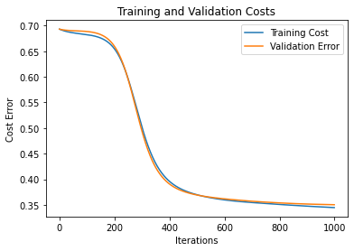

# Heart Disease Classification using Neural Networks From Scratch

## Introduction

Heart disease is one of the leading causes of death worldwide. This project aims to classify heart disease using a neural network model. The dataset consists of 11 features and corresponding binary labels. The goal is to train a neural model to correctly predict whether a patient is suffering from heart disease based on given features.

**Important Note:** This is a **from-scratch generic implementation** of a neural network that can handle **any type of CSV data or even images** for classification. It only requires minor modifications in the data loader and `Training.py` to set the input and output dimensions accordingly. Once adjusted, the model is ready for training on various classification tasks, including different datasets and image classification.

---

## Table of Contents

- [Data Processing](#data-processing)
  - [Pre-processing](#pre-processing)
  - [Data Conversion](#data-conversion)
  - [Feature Scaling](#feature-scaling)
  - [Dataset Details](#dataset-details)
- [Model Parameters](#model-parameters)
- [Model Selection](#model-selection)
- [Model Training and Evaluation](#model-training-and-evaluation)
- [Results](#results)
- [How to Run](#how-to-run)
- [Conclusion](#conclusion)
- [References](#references)

---

## Data Processing

### Pre-processing

- The dataset contains three data types: `object`, `int64`, and `float64`.
- Object data types were converted into numerical values for model compatibility.
- The dataset was checked for missing values (NaN), and none were found.

### Data Conversion

- String-based categorical values were converted into integers.
- Example conversions:
  - `Sex`: Female (0), Male (1)
  - `ChestPainType`: ATA (0), NAP (1), ASY (2), TA (3)
  - `RestingECG`: Normal (0), ST (1), LVH (2)

### Feature Scaling

- Min-Max Scaling was applied to normalize the data using the formula:
  ```math
  x_{scaled} = \frac{x - min(x)}{max(x) - min(x)}
  ```

### Dataset Details

- **Number of features:** 11
- **Dataset split:**
  - Training set: 70%
  - Validation set: 15%
  - Test set: 15%

| Dataset Name   | Number of Examples |
| -------------- | ------------------ |
| Training Set   | 642                |
| Validation Set | 138                |
| Test Set       | 138                |
| **Total**      | **918**            |

---

## Model Parameters

- **Input Layer:** 11 neurons (one for each feature)
- **Hidden Layer:** 20 neurons
- **Output Layer:** 1 neuron (binary classification)
- **Activation Functions:**
  - ReLU for hidden layers
  - Sigmoid for output layer
- **Regularization Parameter:**&#x20;
- **Learning Rate:**&#x20;
- **Training Iterations:** 1000

---

## Model Selection

Two models were tested with different activation functions:

- Model 1: Sigmoid in all layers (performed poorly)
- Model 2: ReLU in hidden layers, Sigmoid in output (better accuracy and convergence)

The best results were achieved with Model 2 using ReLU in hidden layers and Sigmoid in the output layer.

---

## Model Training and Evaluation

- **Optimization:** Gradient Descent
- **Loss Function:** Binary Cross Entropy
- **Backpropagation:** Implemented with Chain Rule
- **Regularization:** L2 Regularization to avoid overfitting
- **Hyperparameter Tuning:** Regularization  tested with values between&#x20;

### Training and Validation Curves
  

---

## Results

| Metric                  | Value  |
| ----------------------- | ------ |
| **Training Accuracy**   | 88.18% |
| **Validation Accuracy** | 86.41% |
| **Test Accuracy**       | 87.37% |
| **Training Loss**       | 0.32   |
| **Validation Loss**     | 0.34   |
| **Test Loss**           | 0.32   |

---

## How to Run

### 1. Clone the Repository

```bash
git clone https://github.com/your-repo/heart-disease-classification.git
cd heart-disease-classification
```

### 2. Train the Model

```bash
python Training.py
```

### 3. Test the Model

```bash
python Prediction.py
```

---

## Conclusion

- A 3-layered neural network was used to classify heart disease with an accuracy of 87%.
- Feature scaling and data preprocessing played a crucial role in achieving good performance.
- The model can be further improved with more training data and additional feature engineering.
- The implementation is **highly adaptable** and can be modified to handle **any CSV dataset or image classification** tasks by adjusting the data loader and input-output dimensions in `Training.py`.

---

This repository contains the full code for heart disease classification using neural networks. Contributions and improvements are welcome!

